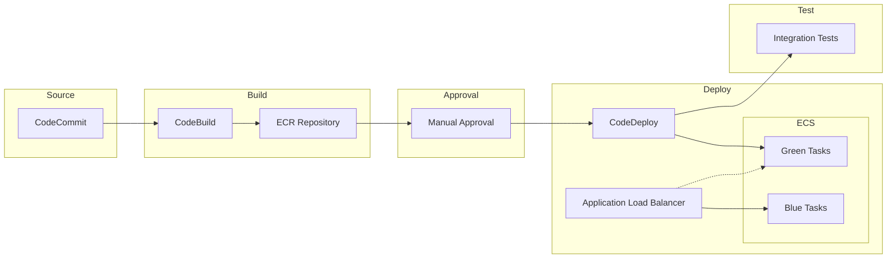
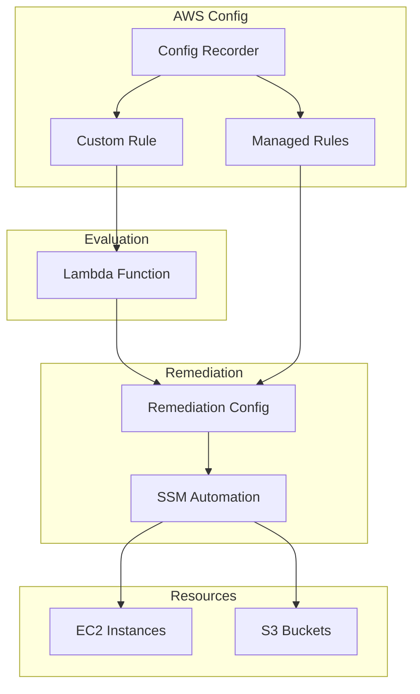
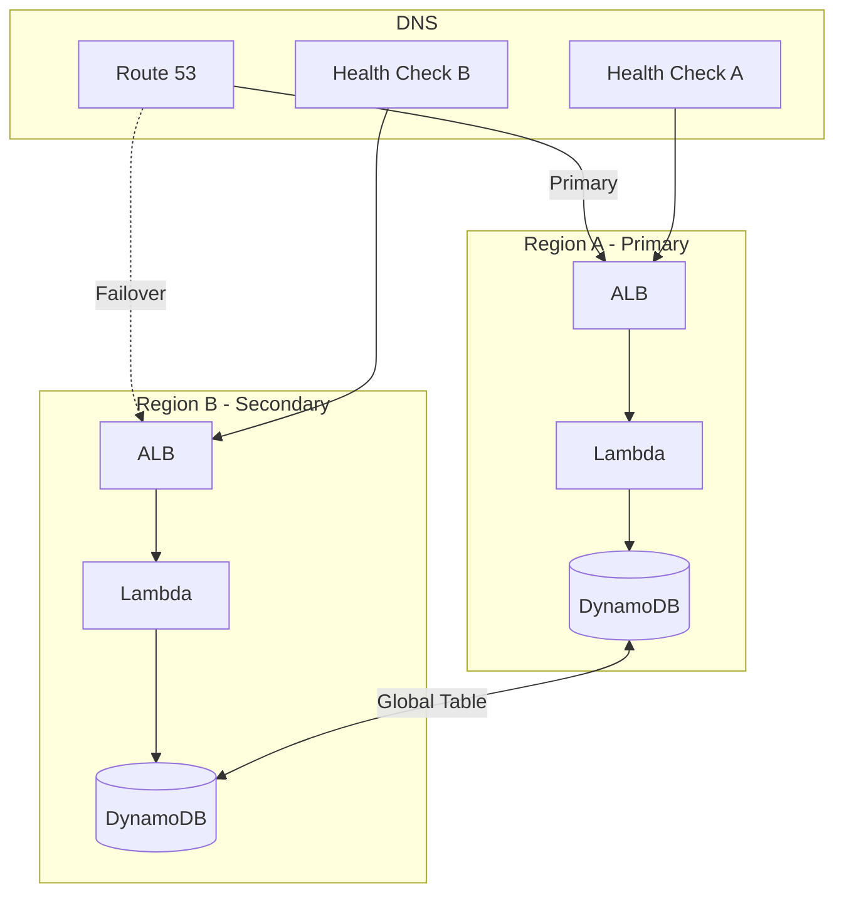
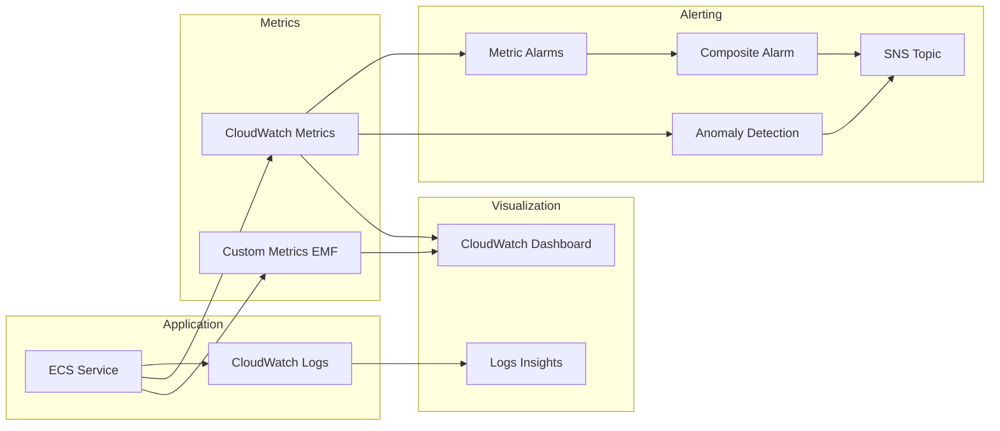
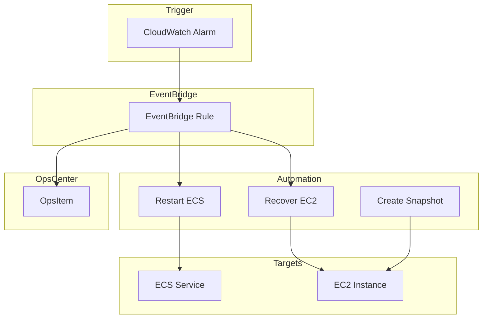
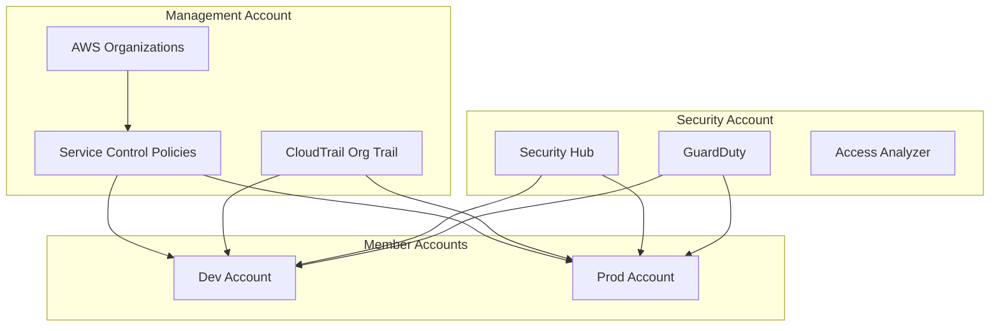
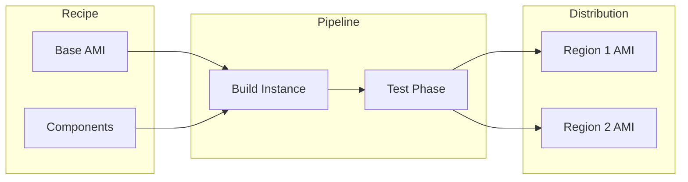
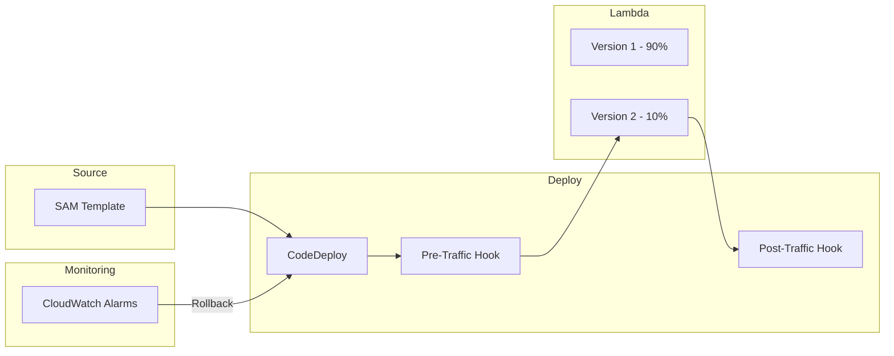

# Architecture Diagrams

## Project A: CI/CD with ECS Blue/Green

## Project B: Config Remediation

## Project C: Multi-Region Architecture

## Project D: Observability

## Project E: Incident Response

## Project F: Governance

## Project G: Additional Topics

### EC2 Image Builder Pipeline

### Lambda SAM Deployment

